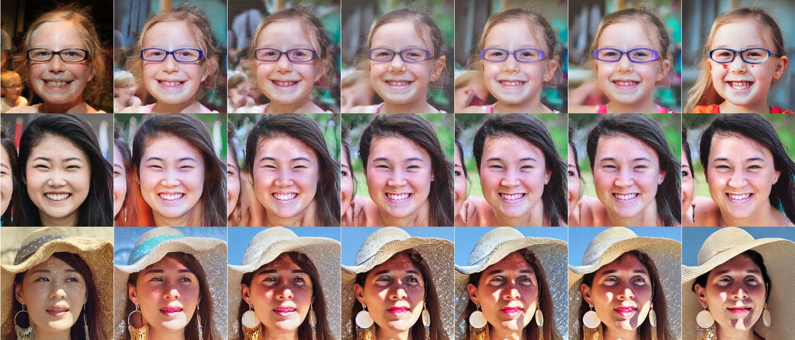
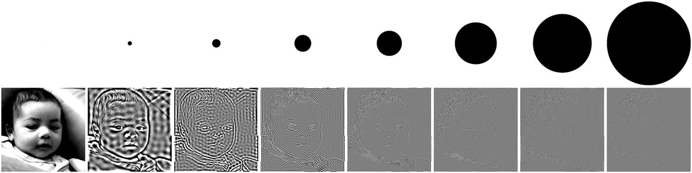

# A Frequency Dial for Structure-Conditioned Diffusion

**School of Computer Science, Soongsil University**

A structure-conditioned diffusion adapter is trained for one operating point.
Canny edges, a depth map, a sketch: each fixes how tightly the output must
follow the condition, and moving that trade-off means training again.

We train a single adapter on conditions whose information content is
randomised — a high-pass filter whose cutoff `r` is drawn per sample — and read
`r` back at inference as a dial.

<p align="center"></p>
<p align="center"><em>One seed, one caption, r swept. Left to right: reference,
then r = 0, 0.05, 0.1, 0.3, 0.5, 0.7, 1.0. The background crowd thins, the
eyewear drifts from the reference, the clothing colour detaches, while identity
and pose survive. The reference is never shown to the model.</em></p>

📄 [Paper (EN)](papers/fa_en.pdf) &nbsp;·&nbsp; [논문 (KO)](papers/fa_ko.pdf)
&nbsp;·&nbsp; [Project page](docs/index.html)

---

## What the cutoff does

<p align="center"></p>
<p align="center"><em>Top: the radial mask, black is removed. Bottom: the
resulting condition, displayed at ±2σ. Columns are r = 0, 0.05, 0.1, 0.2, 0.3,
0.5, 0.7, 1.0.</em></p>

Natural images concentrate their energy at low frequency, so the condition
empties fast — a cutoff of 0.05 already discards 97.5 % of the spectral energy.
Above r ≈ 0.2 the condition looks like flat grey (its standard deviation falls
from 0.196 to 0.041), yet the face outline survives and the model still reaches
SC 0.4019 at r = 0.2. Low contrast is not the same as no
information.

## Operating curve

500 held-out FFHQ-512 images, 50 sampler steps,
CFG 7.5, seed 2026.
**Structure consistency (SC)** re-extracts the condition from the generated
image at the same cutoff and correlates it with the condition the model was
given: feeding the ground truth back scores exactly 1.000, an unrelated face
scores ≈ 0.

| r | SC | Diversity | LPIPS | CLIP | FID |
|---|-----|-----------|-------|------|-----|
| 0.0 | 0.6991 | 0.2994 | 0.3341 | 29.54 | 50.13 |
| 0.05 | 0.7469 | 0.3126 | 0.3495 | 29.41 | 51.58 |
| 0.1 | 0.6211 | 0.3414 | 0.3748 | 29.53 | 54.68 |
| 0.2 | 0.4019 | 0.3719 | 0.4003 | 29.47 | 53.45 |
| 0.3 | 0.2347 | 0.3794 | 0.4148 | 29.73 | 52.77 |
| 0.5 | 0.1259 | 0.4100 | 0.4418 | 29.78 | 53.97 |
| 0.7 | 0.1110 | 0.4334 | 0.4625 | 29.92 | 53.69 |
| 1.0 | 0.0010 | 0.5066 | 0.5329 | 30.30 | 57.40 |

Structure consistency falls and diversity rises monotonically while FID stays
within six points. Across three seeds:

| r | SC mean | std |
|---|---------|-----|
| 0.05 | 0.7479 | 0.0015 |
| 0.1 | 0.6245 | 0.0059 |
| 0.3 | 0.2318 | 0.0106 |

## Turning the adapter down is not the same knob

Holding r = 0.1 and scaling both injection paths instead:

| setting | SC | FID |
|---------|-----|-----|
| adapter strength 0.25 | 0.0408 | 104.95 |
| adapter strength 0.5 | 0.2146 | 76.46 |
| adapter strength 0.75 | 0.4893 | 58.90 |
| adapter strength 1.00 | 0.6211 | 54.68 |
| | | |
| **cutoff r=0.3** | **0.2347** | **52.77** |
| **cutoff r=0.5** | **0.1259** | **53.97** |

Weakening the adapter degrades the image; narrowing the condition's bandwidth
does not. The frequency parameterisation is what makes the trade-off
traversable.

## Where the signal enters matters more than capacity

One field changed per row against the row above it:

| variant | SC r=0.05 | SC r=0.1 | FID r=0.1 |
|---------|-----------|----------|-----------|
| VAE condition, cross-attention only | 0.0234 | 0.0147 | 76.25 |
| + zero-init gate | 0.0303 | 0.0177 | 65.71 |
| + conv condition encoder | 0.1485 | 0.0772 | 56.39 |
| + 128-channel stem | 0.2826 | 0.1882 | 53.17 |
| + 256-channel stem | 0.2986 | 0.2158 | 52.84 |
| + 7x7 window | 0.0359 | 0.0218 | 58.51 |
| **+ skip residuals** | **0.7469** | **0.6211** | **54.68** |

Decomposing the two injection paths at r = 0:

| configuration | SC | FID |
|---------------|-----|-----|
| both paths | 0.6991 | 50.13 |
| skip only | 0.5370 | 65.12 |
| cross-attention only | 0.2112 | 67.07 |
| both off | 0.0368 | 120.50 |

The skip residuals carry most of the structure signal. With both paths off the
model falls to the frozen backbone, which is the control that says the adapter
is doing the work.

## Against ControlNet

Same test images, same captions, each baseline on its own condition:

| method | trainable params | Edge-F1 | LPIPS | FID |
|--------|-----------------|---------|-------|-----|
| ControlNet-Canny | 361,279,120 | 0.6854 | 0.5294 | 71.92 |
| ControlNet-HED | 361,279,120 | 0.5733 | 0.6548 | 118.98 |
| **Ours, r=0.1** | **6,611,469** | **0.7439** | **0.3748** | **54.68** |

The conditions differ — Canny edges against a frequency band — so this compares
operating points, not a like-for-like control.

## Where it does not hold

The useful range is roughly **r ∈ [0, 0.3]**. Above it the condition retains
too little energy for structure consistency to mean much, since two nearly
empty signals correlate near zero whatever the model does.

Everything here is one domain (FFHQ faces) and one backbone (SD1.5). Current
structure-control work has moved to DiT backbones where LoRA-style adapters
report control at a fraction of our parameter count; read the efficiency
numbers against ControlNet, not against that line. Per-cutoff specialists still
beat the single model at r = 0.1. No user study was run.

## Reproducing

```bash
python scripts/fetch_ffhq.py                    # FFHQ-512 with BLIP captions
python scripts/make_splits.py                   # fixed-seed splits
python scripts/check_conditioning.py config/generated/E10b_skip_inject.yaml
python train_fa.py -c config/generated/E10b_skip_inject.yaml
python eval/run_eval.py -c config/generated/E10b_skip_inject.yaml \
       --adapter ckpt_dir/E10b_skip_inject/final/adapter.safetensors --out results/E10b
```

`scripts/check_conditioning.py` gates every run. It asserts the adapter is
present at all cross-attention sites, fully differentiable, and **purely
additive** — with the injection off the network must reproduce stock SD1.5
bit for bit. That last check is the one that catches a whole class of
conditioning bug before any GPU time is spent.

### Building the paper

```bash
cd papers && make        # regenerate numbers from results/, then both PDFs
                make refs # re-verify every reference against the arXiv API
```

No number in either PDF is typed by hand: `scripts/paper_numbers.py` emits them
from `results/*/results.json`, and a missing run fails the build rather than
printing a stale value. All 38 references were checked against the arXiv API
and their abstract pages fetched before entering `refs.bib`.

## Layout

```
datalibs/frequency.py       the filter, shared by the dataloader and evaluation
models/skip_injector.py     ControlNet-style residuals from the raw condition
models/attention_processor.py   local-window attention at cross-attention sites
trainer/fa_trainer.py       training loop
eval/                       metrics, evaluation, baselines, figures
scripts/check_conditioning.py   the gate every run passes first
papers/                     LaTeX sources, generated numbers, verified refs
```

Checkpoints, logs and generated images are not tracked; the scripts above
regenerate them.
